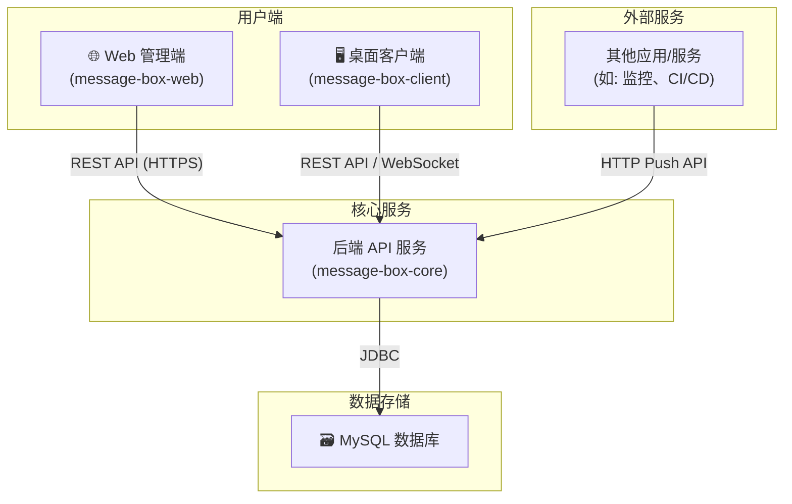

# 消息盒子系统 (Message Box System)

[](https://www.java.com)
[](https://spring.io/projects/spring-boot)
[](https://vuejs.org/)
[](https://tauri.app/)
[](https://www.mysql.com/)
[](LICENSE)

一个灵活的消息推送与管理平台，支持邮件和桌面客户端两种实时通知方式。系统通过统一的HTTP API接收消息，并根据预设的“通道”配置，将消息分发给指定的用户或客户端。

## ✨ 功能简介


- **统一消息入口**: 提供简洁的 HTTP API，可通过 GET 或 POST 请求轻松推送消息。
- **多通道分发**: 通过唯一的 **通道代码 (ChannelCode)** 识别消息来源，并将其路由到不同的接收组。
- **灵活的接收配置**:
  - **邮件接收**: 可配置多个接收邮箱地址，将消息作为邮件发送。
  - **客户端接收**: 支持桌面客户端，通过 WebSocket 实时接收并弹出通知。
- **可配置的发件服务**: 支持自定义配置发件邮箱的 SMTP 服务。
- **Web管理后台**: 提供友好的Web界面，用于管理用户、收发配置和查看发送记录。
- **跨平台桌面客户端**: 基于 Tauri 构建，轻量、高效，可实时接收消息提醒。

## 🏛️ 系统架构



## 🛠️ 技术栈

| 组件                  | 主要技术                                                                           |
| --------------------- | ---------------------------------------------------------------------------------- |
| **后端 (`message-box-core`)**    | `Java 17`, `Spring Boot 3`, `Spring Security`, `MyBatis-Plus`, `MySQL`, `Maven`      |
| **Web前端 (`message-box-web`)**  | `Vue 3`, `Vue Router`, `Pinia`, `Element Plus`, `Axios`, `Vue CLI`               |
| **桌面客户端 (`message-box-client`)** | `Tauri 2`, `Vue 3`, `Vite`, `Rust`                                                 |

## 🚀 环境准备

在开始之前，请确保您的开发环境中安装了以下软件：

1.  **JDK 17**: [Oracle JDK](https://www.oracle.com/java/technologies/javase/jdk17-archive-downloads.html) 或 [OpenJDK](https://openjdk.java.net/projects/jdk/17/)
2.  **Maven**: [官方网站](https://maven.apache.org/download.cgi)
3.  **Node.js**: `v18.x` 或更高版本。 [官方网站](https://nodejs.org/)
4.  **Rust**: [官方网站](https://www.rust-lang.org/tools/install) (为Tauri客户端提供构建环境)
5.  **MySQL**: `8.0` 或更高版本。

## 📦 启动项目

请按照以下步骤启动完整的消息盒子系统。

### 1. 克隆项目

```bash
git clone <your-repository-url>
cd message-box-core
```

### 2. 数据库配置

1.  在您的 MySQL 服务中创建一个新的数据库，例如 `msg_box_db`。
2.  导入项目根目录下的 `database_schema.sql` 文件（**注意**：此文件需手动创建，将项目中的所有 `CREATE TABLE` 语句汇总于此），以创建所有必要的表。
3.  修改后端配置文件 `message-box-core/src/main/resources/application.yaml`，更新您的数据库连接信息：
    ```yaml
    spring:
      datasource:
        url: jdbc:mysql://localhost:3306/msg_box_db?serverTimezone=UTC&useUnicode=true&characterEncoding=utf-8
        username: your_mysql_username
        password: your_mysql_password
    ```

### 3. 启动后端服务

打开一个新的终端窗口：

```bash
# 进入后端项目目录
cd message-box-core

# 使用 Maven 启动 Spring Boot 应用
mvn spring-boot:run
```

当您在控制台看到 `Started MsgBoxServiceApplication in ... seconds` 时，表示后端服务已成功启动（默认端口为 `8080`）。

### 4. 启动Web管理后台

打开一个新的终端窗口：

```bash
# 进入Web前端项目目录
cd message-box-web

# 安装依赖
npm install

# 启动开发服务器
npm run serve
```

Web后台将运行在 `http://localhost:8081` (或终端提示的其它端口)。

### 5. 启动桌面客户端

打开一个新的终端窗口：

```bash
# 进入桌面客户端项目目录
cd message-box-client

# 安装依赖
npm install

# 启动Tauri开发环境
npm run tauri-dev
```

稍等片刻，Tauri 桌面客户端将会启动。您可以在客户端中输入在Web后台配置的`ChannelCode`来接收消息。

---

现在，整个系统已经完全运行起来了！您可以通过Web后台进行配置，并通过API或客户端进行消息的收发测试。 